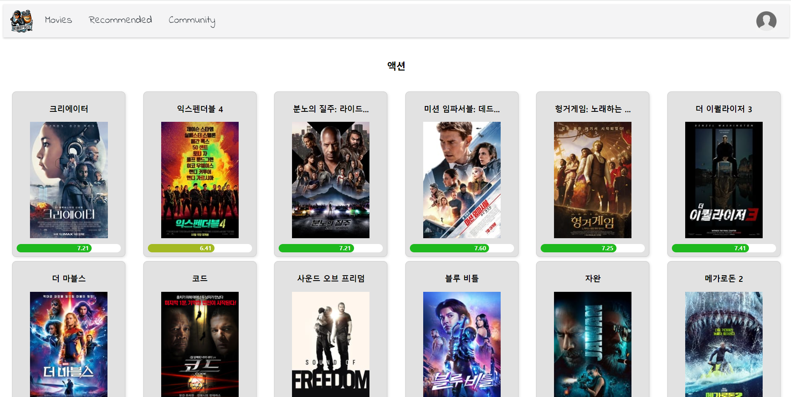

# 강정수 & 김형규

## \#1 Get Started

> 서버 설치 및 실행

### \#1-1 Back

```bash
$ git clone (backend repo 주소)
---- 하위 폴더 이동
$ python -m venv venv (가상 환경 생성)
$ source venv/Scripts/activate (가상 환경 실행)
$ pip install -r requirements (장고 및 패키치 설치)
$ python manage.py migrate (데이터베이스에 모델 반)
$ python manage.py loaddata genre_data.json actor_data.json movie_data.json (데이터 불러오기)
$ python manage.py runserver (서버 실행)
```

### \#1-2 Front

```bash
$ git clone (frontend repo 주소)
---- 하위 폴더 이동
$ npm install (Vue 및 패키지 설치)
$ npm run dev (서버 실행)
```

## \#2 개요

### \#2-1 Vue

```
final-pjt-front/src
|--App.vue
|--assets
|  |--facebook_png_640.png
|  |--logo.png
|  |--말풍선.png
|  |--부추1.png
|  |--빈하트.png
|  |--점점점.png
|  `--하트.png
|--components
|  |--Article
|  |  |--ArticleDetail.vue
|  |  |--ArticleDetailComment.vue
|  |  |--ArticleDetailCommentItem.vue
|  |  |--ArticleDetailCommentRecomment.vue
|  |  |--ArticleDetailCommentRecommentItem.vue
|  |  |--ArticleList.vue
|  |  `--ArticleListItem.vue
|  |--Movie
|  |  |--MovieDetail.vie
|  |  |--MovieDetailActors.vue
|  |  |--MovieDetailActorsItem.vue
|  |  |--MovieDetailComment.vue
|  |  |--MovieDetailCommentItem.vue
|  |  |--MovieDetailModal.vue
|  |  |--MovieGenreList.vue
|  |  |--MovieList.vue
|  |  |--MovieListItem.vue
|  |  `--MovieRecommendList.vue
|  `--User
|     |--UserArticles.vue
|     |--UserComments.vue
|     |--UserFollower.vue
|     |--UserFollowing.vue
|     |--UserLikeArticleItem.vue
|     |--UserLikeArticles.vue
|     |--UserLikeMovieItem.vue
|     `--UserLikeMovies.vue
|--main.js
|--router
|  `--index.js
|--stores
|  |--articles.js
|  |--movies.js
|  `--user.js
`--views
   |--ActorView.vue
   |--ArticleCreateView.vue
   |--ArticleDetailView.vue
   |--ArticleUpdateView.vue
   |--CommunityListView.vue
   |--EasterEggView.vue
   |--LoginView.vue
   |--MovieDetailView.vue
   |--MovieGenreView.vue
   |--MovieListView.vue
   |--RecommendedViewView.vue
   |--SignUpView.vue
   `--UserDetailView.vue
```

### \#2-2 Template & Components


### \#2-3. ER Diagram


## \#2-4 팀원 정보 및 업무 분담 내역

| 김형규 (팀장)                                                       | 강정수 (팀원)                                                                                   |
|:--------------------------------------------------------------:|:------------------------------------------------------------------------------------------:|
| **백엔드**<br/>데이터베이스와 API 설계 및 구현<br/>**프론트엔드**<br/>컴포넌트 설계 및 구현 | **백엔드** <br/>MovieComment 모델 설계<br/>**프론트엔드** <br/>CSS 및 스타일링<br/>YoutubeAPI를 활용한 Modal 구현 |

## \#3 핵심 기능 & 디자인

### \#3-1 네비게이션 바


- 사용자가 어떤 페이지에 있는지와 관계 없이 표시됩니다. 

- 사용자의 인증 여부에 따라 오른쪽의 드롭다운의 내용이 달라집니다.


### \#3-2 홈


- 메인 페이지에서는 영화 목록과 제목을 활용한 영화 검색 기능이 제공됩니다.

- 검색창 하단의 장르 버튼을 이용해 특정 장르의 영화들을 볼 수 있습니다. 

- 네비게이션 바 위에 프로그레스 바가 적용되어 있습니다. 


- 검색 기능을 사용해 제목에 '해리 포터'가 포함된 영화들을 검색한 예시입니다. 

### \#3-3 추천 영화 목록


- 인증된 사용자들만 접근할 수 있습니다. 

- 사용자가 좋아요 한 영화들을 바탕으로 사용자가 가장 선호하는 영화 장르를 파악한 다음, 해당 장르의 영화들 중 사용자가 좋아요 하지 않은 영화들을 추천합니다.

- 추가적으로 평점이 높은 영화들과 평가 수가 많은 영화들을 제공합니다.

### #3-4 장르별 영화



- 특정 장르에 속한 영화 목록을 제공합니다. 

- 네비게이션 바 위에 프로그레스 바가 적용되어 있습니다. 

### #3-5 영화 상세 정보


- 영화 상세 정보를 제공합니다

- 영화 출연진 목록의 개별 항목을 통해 배우 상세 정보로 이동할 수 있습니다.

- 인증된 사용자는 자신이 좋아하는 영화에 좋아요를 남기거나, 좋아요 한 영화의 좋아요를 취소할 수 있습니다.

- 인증된 사용자는 영화에 리뷰를 남길 수 있습니다. 사용자가 남긴 리뷰는 데이터 베이스에 반영됩니다.

- 이미 리뷰를 작성한 사용자는 추가적인 리뷰를 작성할 수 없습니다. 하지만 작성한 리뷰를 수정하거나 삭제할 수 있습니다. 수정하거나 삭제된 리뷰의 정보 역시 데이터 베이스에 반영됩니다.  

### #3-6 배우 상세 정보


- 해당 배우가 출연한 영화들의 정보를 제공합니다.

- 영화 목록의 개별 항목을 통해 해당 영화의 상세 정보 페이지로 이동할 수 있습니다. 

### #3-7 로그인


- 로그인 페이지 입니다. 

### #3-8 회원가입


- 회원가입 페이지 입니다. 

### #3-9 게시판


- 인증된 사용자들만 접근할 수 있습니다. 

- 게시글들의 목록을 제공합니다. 게시글 작성 및 페이지네이션을 구현했으며, 최근에 작성된 게시글 순으로 게시글을 제공합니다. 

### #3-10 상세 게시글 및 댓글 작성


- 인증된 사용자들만 접근할 수 있습니다. 

- 상세 게시글의 제목, 작성자, 내용, 댓글들을 제공합니다.

- 게시글의 작성자를 클릭하면, 해당 사용자의 프로필로 이동합니다. 

- 작성자는 게시글을 삭제 및 수정할 수 있습니다. 

- 개별 게시글에 좋아요를 누를 수 있습니다. 

- 댓글을 작성할 수 있습니다. 

### #3-11 상세 댓글 및 대댓글


- 댓글의 작성자와 내용, 좋아요 여부와 수를 제공합니다. 

- 작성자는 댓글을 수정하거나 삭제할 수 있습니다.

- 댓글의 작성자를 클릭하면, 해당 사용자의 프로필로 이동합니다.

- 개별 댓글에 좋아요를 남길 수 있습니다. 

- 댓글 왼쪽 아래의 더보기... 를 누를 경우, 대댓글 작성 및 대댓글 목록이 제공됩니다. 

- 대댓글에서도 댓글과  같은 작성자 프로필 이동, 좋아요, 수정 및 삭제 기능이 구현되어 있습니다. 

### #3-12 사용자 프로필


- 사용자의 개인 프로필 페이지입니다. 

- 타인의 프로필을 팔로우 및 언팔로우 할 수 있습니다. 

- 해당 정보들이 드롭다운으로 구현되어 제공됩니다. 
  
  - 해당 사용자가 팔로우 하는 사람들
  
  - 해당 사용자를 팔로우 하는 사람들
  
  - 해당 사용자가 작성한 게시글
    
    - 페이지네이션이 적용되어 있습니다. 
  
  - 해당 사용자가 작성한 댓글
    
    - 페이지네이션이 적용되어 있습니다. 
  
  - 해당 사용자가 좋아요 한 게시글
  
  - 해당 사용자가 좋아요 한 영화
    
    - 가로 스크롤 바가 적용되어 있습니다.

## \#4 느낀점

#### 강정수

- 이번 학기 말의 영화 추천 사이트 프로젝트는 저에게 정말 흥미로운 도전이었습니다. 프로젝트를 통해 코딩 능력뿐만 아니라 사용자의 심리와 취향을 심층적으로 이해하고 반영하는 과정에서 큰 성장을 경험했습니다.
  
  프론트엔드를 맡아 사용자와의 직접적인 인터랙션을 디자인하고 구현하는 과정에서, 사용자들이 어떤 경험을 원하며 어떤 기능을 선호하는지를 고민하는 시간은 정말 소중했습니다. 이러한 고민 끝에 나온 결과물은 사용자들에게 보다 맞춤형이고 만족스러운 서비스를 제공하고자 하는 노력의 결실이었습니다.
  
  또한, 다양한 분야에서 협업하는 경험은 팀원과의 소통 능력을 크게 향상시켰습니다. 서로 다른 배경을 가진 팀원과의 아이디어 교환과 효과적인 협업을 통해 프로젝트의 성과를 높이는 방법을 배우게 되었습니다.
  
  이 프로젝트를 통해 얻은 것 중에서 가장 소중한 것은 기술적인 역량뿐만 아니라 '사용자 중심의 개발'이라는 새로운 시각을 얻었다는 것입니다. 앞으로는 이러한 관점을 바탕으로 더 나은 서비스를 만들어 나가고, 지속적인 성장을 이루어 나가겠습니다. 앞으로의 여정이 더욱 흥미진진해질 것을 기대하며, 새로운 도약을 위해 더욱 노력해야할 것 같습니다.
